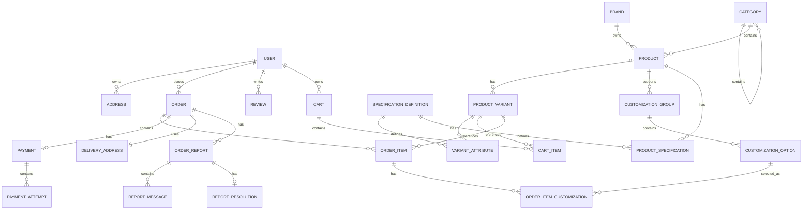

# JMSCommerce — Production-Ready E-Commerce Platform

**JMSCommerce** is a full-stack, production-oriented e-commerce platform built with **Java, Spring Boot, Spring Security, React, MySQL, Redis, Flyway, and Razorpay**.

It implements real-world commerce workflows including **product discovery, variants, customizations, Redis-backed cart management, checkout, COD/online payments, inventory reservation, orders, reviews, and customer support reports**.

### 🚀 Live Demo
**[https://jmscommerce.in](https://jmscommerce.in)**

## 🔐 Test Credentials
- **ADMIN**
- **Email:** `testadmin@gmai.com`
- **Password:** `Admin@123`

- **USER - use this or register/google Oauth**
- **Email:** `tonystark123@gmail.com`
- **Password:** `TonyStark@123`

### 💻 Source Code

- **Backend:** [JMSCommerce_dev](https://github.com/saumya123tp8/JMSCommerce_dev)
- **Frontend:** [JMSCommerce_Dev_UI](https://github.com/saumya123tp8/JMSCommerce_Dev_UI)

---

## ⭐ Why This Project?

JMSCommerce was designed beyond a basic CRUD e-commerce application, with a focus on:

- **Scalable data access and caching**
- **Concurrency-safe inventory management**
- **Failure-resilient payment processing**
- **Secure authentication and authorization**
- **Transactional business workflows**
- **Production deployment using Docker and AWS**
- **Maintainable domain-driven backend design**

---

## ✨ Key Features

### Customer

- JWT-based authentication with access/refresh tokens
- Refresh-token rotation
- Google and GitHub OAuth2
- Role-based authorization
- User profile and Email verification
- Address management
- Product, category, and brand browsing
- Product specifications
- Product variants
- Product customization
- Redis-backed shopping cart
- Checkout
- Cash on Delivery
- Razorpay online payments
- Payment retry
- Order tracking
- Product reviews
- Order issue reporting
- Customer/admin report conversations
- Report resolution

### Admin

- Product management
- Category and brand management
- Variant management
- Customization and Specification management
- Order operations
- Payment operations
- User management
- Customer report management
- Report status transitions
- Admin responses and resolution
- Application monitoring

---

# 🏗️ Architecture

The backend follows a layered architecture with clear separation between API, business logic, persistence, and external integrations.

```text
                    React Frontend
                          │
                          ▼
                     REST APIs
                          │
                          ▼
                  ┌───────────────┐
                  │  Controllers  │
                  └───────┬───────┘
                          │
                          ▼
                  ┌───────────────┐
                  │    Services   │
                  │               │
                  │ Business Logic│
                  │ Transactions  │
                  │ Validation    │
                  │ Authorization │__________
                  └───────┬───────┘         │
                          │                 │
                    ┌─────┴─────┐           │
                    ▼           ▼           │
              Repositories   Razorpay       │
                    │                       │
                    ▼                       │
                  MySQL                     │
                    ▲                       │
                    │                       │
                  Redis ---------------------
               Cart / TTL
```

The application uses **DTOs and adapters** around the persistence model so JPA entities are not directly exposed as public API contracts.

---

## 🧩 Entity Relationship Diagram

The following diagram represents the core domain relationships of JMSCommerce, including product catalog, variants, cart, orders, payments, reviews, and customer reports.


# 🔐 Authentication & Authorization

JMSCommerce implements JWT authentication using **access and refresh tokens**.

### Authentication flow

```text
Login
  ↓
Generate Access Token
  ↓
Generate Refresh Token
  ↓
Persist Refresh Token
  ↓
Authenticated API Requests
```

The access token contains claims such as:

```text
email / subject
roles
token type
issuer
issued-at
expiration
JTI
```

### Refresh Token Rotation

```text
Refresh Token
      ↓
Verify JWT
      ↓
Validate Token Type
      ↓
Find Stored Token by JTI
      ↓
Check Revoked / Expired
      ↓
Validate User
      ↓
Revoke Old Token
      ↓
Generate New JTI
      ↓
Generate New Refresh Token
      ↓
Generate New Access Token
```

Refresh tokens are persisted server-side and rotated after successful refresh operations.

### OAuth2

OAuth2 login is supported through:

- Google
- GitHub

### Authorization

Administrative operations use role-based authorization:

```text
ROLE_ADMIN
ROLE_GUEST
```

Protected endpoints use Spring Security authorization rules such as:

```java
@PreAuthorize(AppConstants.HAS_ADMIN_OR_DEVELOPER)
```

---

# 🛍️ Product Catalog

The catalog supports:

- Products
- Categories
- Brands
- Specifications
- Variants
- Customizations

A product can contain information such as:

```text
name
currency
primaryImage
shortDescription
description
category
brand
specifications
inventoryType
```

Product requests use Jakarta Bean Validation and product names are normalized with generated slugs.

---

# 🌳 Hierarchical Categories & Specifications

Categories support hierarchical relationships.

Example:

```text
Beverages
   ↓
Coffee
   ↓
Hot Coffee
   ↓
Cappuccino
```

Specifications can be inherited through the category hierarchy.

For example:

```text
Coffee
   ↓
Hot Coffee
   ↓
Cappuccino
```

A specification defined at a parent category can therefore be available to products under descendant categories.

This avoids duplicating the same specification definitions across every child category.

---

# 🎨 Product Variants & Customization

## Variants

A product can contain multiple variants.

Example:

```text
Cappuccino
 ├── Small / Hot
 ├── Medium / Hot
 ├── Large / Hot
 └── Large / Cold
```

Variants support:

```text
MRP
sellingPrice
stock
SKU
barcode
attributes
displayName
```

The variant workflow validates:

- SKU uniqueness
- Barcode uniqueness
- Duplicate variants
- Required attributes
- Product/variant relationships

Variant updates can also synchronize product pricing.

## Customization

Products can define customization groups and options.

Example:

```text
Cappuccino
 ├── Milk
 │    ├── Regular Milk
 │    └── Almond Milk +₹20
 │
 └── Toppings
      ├── Chocolate Syrup +₹20
      └── Caramel Drizzle +₹25
```

Customization groups support:

```text
selectionType
required
minSelection
maxSelection
displayOrder
```

Options support:

```text
name
adjustmentType
adjustmentValue
displayOrder
```

---

# 🛒 Redis-Backed Cart

Redis is used for temporary cart state and high-frequency cart operations.

```text
Frontend
   ↓
Cart API
   ↓
Cart Service
   ↓
Redis
   ↓
Checkout 
   ↓
Validate Inventory
   ↓
Validate current price from backend
   ↓
Persist current discount, price, address etc.
   ↓
Route to razorpay for payment
```

The cart is treated as temporary commerce state, while permanent order information remains in MySQL.

Redis provides:

- Fast reads/writes
- TTL-based cart expiration
- Reduced relational database traffic
- Temporary session-like commerce state

The current cart TTL configuration is **10 days**.

---

# 📦 Order Management

Orders contain:

```text
orderNumber
status
paymentStatus
subtotal
discount
tax
deliveryCharge
grandTotal
currency
deliveryAddress
user
payment
```

Order items preserve historical commerce information such as:

```text
variant
quantity
mrp
sellingPrice
customizationPrice
totalPrice
sku
variantName
productName
inventoryReserved
```

This creates **order snapshots**, ensuring historical orders remain accurate even if the product catalog changes later.

### Order Lifecycle

```text
PENDING
   ↓
CONFIRMED
   ↓
PROCESSING
   ↓
SHIPPED
   ↓
DELIVERED
```

Cancellation is supported from applicable states, while terminal states include:

```text
DELIVERED
CANCELLED
```

Invalid state transitions are rejected by transition validation.

---

# 💳 Payment Processing

The payment model separates a **Payment** from individual **PaymentAttempts**.

```text
Order
  │
  ▼
Payment
  │
  ├── Attempt #1 → FAILED
  ├── Attempt #2 → FAILED
  └── Attempt #3 → SUCCESS
```

This design preserves payment-attempt history and allows failed payments to be retried without creating a new order/payment record.

## COD

```text
Create Order
     ↓
Payment = PENDING
Order = CONFIRMED
     ↓
Cart Cleared
```

## Online Payment

```text
Create Order
     ↓
Order = PENDING
Payment = PENDING
     ↓
Initiate Payment
     ↓
Create Payment Attempt
     ↓
Create Razorpay Order
     ↓
Razorpay Checkout
     ↓
Verify Signature
     ↓
Payment SUCCESS
     ↓
Order PaymentStatus = SUCCESS
     ↓
Order = CONFIRMED
```

### Payment Reliability

The payment workflow includes:

- Isolated payment attempts
- Payment retries
- Razorpay signature verification
- Webhook verification
- Explicit payment states
- Duplicate callback handling
- Payment ownership validation

Supported webhook events include:

```text
payment.captured
payment.failed
```

Webhook processing is idempotent for already-successful payment attempts.

---

# 🔒 Concurrency & Data Integrity

Concurrency is treated as a first-class concern in important commerce workflows.

The application uses:

- Optimistic locking/versioning
- Transactional service methods
- Atomic database updates
- Inventory reservation/release
- Payment-attempt validation
- Explicit state-transition validation

This helps protect against:

- Overselling
- Lost updates
- Invalid order states
- Invalid payment state transitions
- Duplicate payment callbacks

Important transactional workflows include:

```text
Product creation
Variant updates
Payment verification
Payment webhook processing
Payment retry
Order workflows
Report workflows
```

The common persistence model includes a `version` field for optimistic locking where applicable.

---

# 🧾 Customer Order Reports

Customers can report issues against their own orders.

Supported reasons include:

```text
WRONG_ITEM_DELIVERED
ORDER_NOT_RECEIVED
POOR_PACKAGING
LATE_DELIVERY
OTHER
```

A report contains:

```text
order
reason
description
status
messages
resolution
createdAt
updatedAt
```

### Report Lifecycle

```text
OPEN
  ↓
IN_REVIEW
  ↓
RESOLVED
  ↓
CLOSED
```

Reports support user/admin conversations and resolutions such as:

```text
REFUND
REPLACEMENT
CREDIT
COMPENSATION
NO_ACTION
OTHER
```

---

# ⭐ Reviews

Customers can submit product ratings and reviews.

The product-detail frontend loads reviews independently and can refresh the review list after submission.


---

# 🔄 Database Migrations

**Flyway** manages database schema migrations.

```yaml
spring:
  flyway:
    enable: true
    location: classpath:db/migration
```

Migration files are maintained under:

```text
src/main/resources/db/migration
```

This keeps database changes version-controlled and reproducible across environments.

---

# 🌐 API Design

The REST API uses the base path:

```text
/api/v1
```

Responses follow a common wrapper:

```json
{
  "success": true,
  "message": "Operation message",
  "data": {},
  "error": null,
  "timestamp": "2026-08-13T21:34:59.9819756",
  "path": null
}
```

This provides the frontend with a consistent API contract.

### Some of Example Endpoints

#### Products

```http
GET    /api/v1/products
POST   /api/v1/products
GET    /api/v1/products/{id}
GET    /api/v1/products/{id}/details
GET    /api/v1/products/{id}/specifications
GET    /api/v1/products/search/filter?coffee
PUT    /api/v1/products/{id}
```

#### Payments

```http
POST  /api/v1/payments/orders/{orderId}/initiate
POST  /api/v1/payments/verify
POST  /api/v1/payments/webhook
POST  /api/v1/payments/orders/{orderId}/retry
PATCH /api/v1/payments/orders/{orderId}/attempts/{attemptId}/cancel
```

#### Order Reports

```http
POST  /api/v1/orders/{orderId}/reports
GET   /api/v1/users/me/order-reports
GET   /api/v1/order-reports/{reportId}
POST  /api/v1/order-reports/{reportId}/messages

GET   /api/v1/admin/order-reports
POST  /api/v1/admin/order-reports/{reportId}/messages
POST  /api/v1/admin/order-reports/{reportId}/resolve
```

---

# ⚠️ Validation & Exception Handling

DTOs use Jakarta Bean Validation:

```java
@NotBlank
@NotNull
@NotEmpty
@Size
@Positive
@PositiveOrZero
@Min
@Max
```

Business-level validation covers:

- Duplicate products
- SKU uniqueness
- Barcode uniqueness
- Duplicate variants
- Specification validity
- Order ownership
- Payment ownership
- Payment signatures
- Order state transitions
- Report state transitions

Custom exceptions include:

```text
BadRequestException
ResourceNotFoundException
PaymentGatewayException
BadCredentialsCustomException
```

A global exception handler converts exceptions into consistent API responses.

---

# 📊 Observability

The application integrates **Spring Boot Actuator and Micrometer** for application monitoring.

Useful endpoints include:

```text
/actuator/health
/actuator/info
/actuator/metrics
/actuator/prometheus
/actuator/flyway
```

These expose application and runtime metrics such as JVM and HTTP metrics.

Prometheus/Grafana can be used for metrics collection and visualization. Sensitive Actuator endpoints should remain protected in production.

---

# ☁️ Deployment

The application is **containerized with Docker and deployed on AWS**.

Current deployment architecture includes:

```text
                    Internet
                       │
                       ▼
                 Custom Domain
                       │
                       ▼
                 AWS EC2
                       │
                 ┌─────┴─────┐
                 │   Docker  │
                 │ Backend   │
                 └─────┬─────┘
                       │
              ┌────────┴────────┐
              ▼                 ▼
            MySQL             Redis

                       │
                       ▼
                     S3
                Media Storage
```

The production environment uses environment-based configuration for sensitive credentials and application settings.

---


---

# 🧠 Key Engineering Decisions

### DTO-Based API Boundary

JPA entities are not directly exposed through public APIs.

DTOs provide:

- Request validation
- Response shaping
- Reduced coupling
- Safer entity evolution
- Clear frontend contracts

### Payment vs PaymentAttempt

Separating payment records from attempts preserves payment history and supports retries:

```text
Payment
 ├── Attempt #1 → FAILED
 ├── Attempt #2 → FAILED
 └── Attempt #3 → SUCCESS
```

### Redis for Cart

Cart data is temporary and frequently accessed, making Redis suitable for:

- Fast reads/writes
- TTL
- Reduced relational DB traffic
- Temporary commerce state

Permanent order data remains in MySQL.

### Order Snapshots

Order items preserve historical values such as:

```text
productName
variantName
SKU
MRP
sellingPrice
customizationPrice
```

so historical orders remain independent of future product-catalog changes.

### Hierarchical Specifications

Parent-category specifications can be resolved for descendant products, avoiding repeated specification definitions.

### Controlled State Transitions

Order and report states are explicitly validated instead of allowing arbitrary state changes, preventing invalid business states.

---

# 📁 Project Structure

```text
JMSCommerce/
├── backend/
│   ├── src/
│   │   ├── main/
│   │   │   ├── java/com/example/JMSCommerce/
│   │   │   │   ├── Adapters/
│   │   │   │   ├── Auth/
│   │   │   │   ├── Controller/
│   │   │   │   ├── DTOs/
│   │   │   │   ├── Exception/
│   │   │   │   ├── Model/
│   │   │   │   ├── Repositories/
│   │   │   │   ├── Services/
│   │   │   │   ├── Utility/
│   │   │   │   └── config/
│   │   │   └── resources/
│   │   │       ├── application.yml
│   │   │       └── db/migration/
│   │   └── test/
│   └── build.gradle
│
└── frontend/
    ├── src/
    ├── public/
    ├── package.json
    └── vite.config.*
```

---

# 🛠️ Technology Stack

| Layer | Technology |
|---|---|
| Language | Java |
| Backend | Spring Boot |
| Security | Spring Security |
| Authentication | JWT, OAuth2 |
| ORM | JPA / Hibernate |
| Database | MySQL |
| Cache / Cart | Redis |
| Migration | Flyway |
| Payments | Razorpay |
| Validation | Jakarta Bean Validation |
| API | REST |
| Frontend | React |
| Routing | React Router |
| HTTP Client | Axios |
| Monitoring | Spring Boot Actuator, Micrometer |
| Build | Gradle |
| Containerization | Docker |
| Cloud | AWS |
| Media Storage | Amazon S3 |

---

# 🚀 Local Development

## Prerequisites

- Java
- Gradle
- MySQL
- Redis
- Node.js / npm
- Razorpay test credentials for online-payment testing

## Database

```sql
CREATE DATABASE practice_springjpa;
```

Configure MySQL using local configuration or environment variables.

## Redis

Run Redis locally on:

```text
localhost:6379
```

## Backend

```bash
cd backend
./gradlew build
./gradlew bootRun
```

Windows:

```powershell
gradlew.bat build
```

Backend:

```text
http://localhost:8080
```

## Frontend

```bash
cd frontend
npm install
npm run dev
```

Frontend:

```text
http://localhost:5173
```

---

# 🔮 Future Improvements

Potential future engineering improvements include:

- Expand automated integration-test coverage
- Testcontainers for MySQL/Redis integration tests
- Prometheus + Grafana dashboards
- Centralized logging
- Distributed tracing
- Rate limiting
- Advanced product search/filtering
- More comprehensive performance testing
- Improved inventory reservation/release workflows
- CI/CD pipeline

These are **future improvements and are not claims about the current implementation**.

---

# 🔒 Production Security Notes

For production deployments:

- Keep JWT signing secrets server-side.
- Keep Razorpay credentials server-side.
- Verify Razorpay payment/webhook signatures on the backend.
- Protect administrative APIs with role-based authorization.
- Validate resource ownership for customer operations.
- Protect sensitive Actuator endpoints.
- Use secure refresh-token handling.
- Never commit production credentials or secrets.

---

# 📌 Project Status

JMSCommerce currently provides a complete commerce workflow:

```text
Authentication
      ↓
Product Catalog
      ↓
Categories / Specifications
      ↓
Variants / Customization
      ↓
Redis Cart
      ↓
Checkout
      ↓
COD / Razorpay
      ↓
Orders
      ↓
Reviews
      ↓
Order Reports
      ↓
Admin Resolution
```

The project demonstrates practical backend engineering across **domain modeling, REST API design, authentication, authorization, persistence, caching, transactions, concurrency, payment integration, state management, observability, and cloud deployment**.

---

## 👨‍💻 Author

**Saumya Keservani**

- GitHub: [saumya123tp8](https://github.com/saumya123tp8)
- Live Demo: [jmscommerce.in](https://jmscommerce.in)